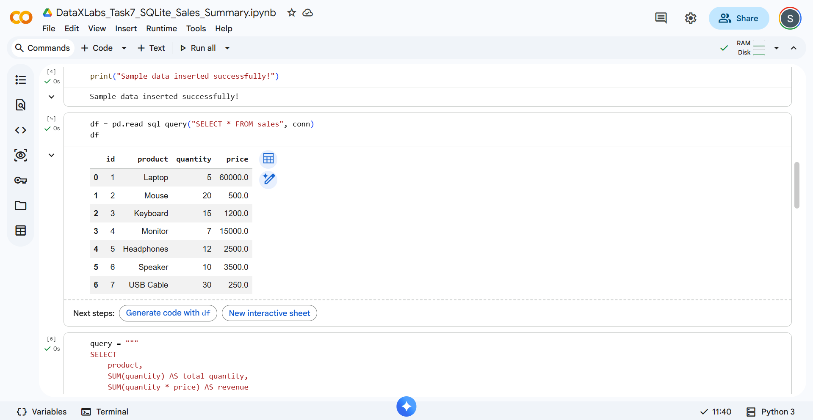
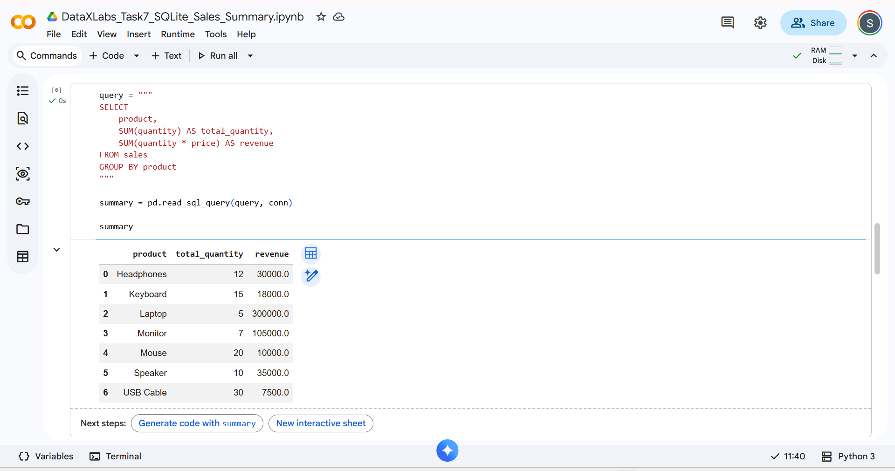
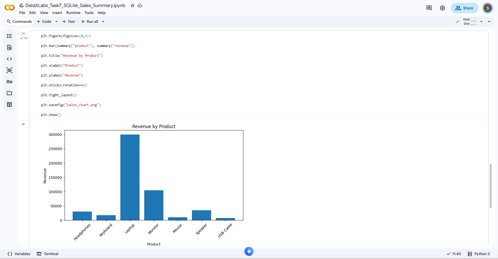

# 📊 DataXLabs Task 7 - Basic Sales Summary using SQLite and Python

## 📌 Project Overview

This project demonstrates how to use **SQLite with Python** to store, retrieve, and analyze sales data. SQL queries are executed using Python, the results are displayed with **Pandas**, and a **Matplotlib** bar chart is created to visualize product revenue.

---

## 🎯 Objective

- Create a SQLite database (`sales_data.db`)
- Create a Sales table
- Insert sample sales records
- Execute SQL queries using Python
- Generate a sales summary
- Visualize revenue using a bar chart

---

## 🛠️ Technologies Used

- Python
- SQLite3
- Pandas
- Matplotlib

---

## 📂 Project Files

```
DataXLabs_Task7_SQLite_Sales_Summary/
│
├── Task-7-DataXLabs_SQLite_Sales_Summary.ipynb
├── sales_data.db
├── sales_chart.png
├── README.md
├── requirements.txt
├── database_created.png
└── sales_summary.png
```

---

## 🗄️ Database Structure

| Column | Description |
|---------|-------------|
| id | Product ID |
| product | Product Name |
| quantity | Quantity Sold |
| price | Product Price |

---

## 💻 SQL Query Used

```sql
SELECT
    product,
    SUM(quantity) AS total_quantity,
    SUM(quantity * price) AS revenue
FROM sales
GROUP BY product;
```

---

## 📈 Project Output

### 📌 Database Records



---

### 📌 Sales Summary



---

### 📌 Revenue Bar Chart



---

## 🚀 Features

- SQLite database creation
- Data insertion using Python
- SQL queries executed inside Python
- Sales summary generation
- Revenue analysis
- Data visualization with Matplotlib

---

## ▶️ How to Run

1. Clone this repository.
2. Install the required libraries:

```bash
pip install -r requirements.txt
```

3. Open the notebook:

```
Task-7-DataXLabs_SQLite_Sales_Summary.ipynb
```

4. Run all cells.

---

## 📦 Requirements

```
pandas
matplotlib
```

---

## 👩‍💻 Author

**Kapa Sri Lakshmi**

B.Tech Computer Science Engineering

Data Analyst Aspirant

---

⭐ If you found this project helpful, feel free to star this repository!
